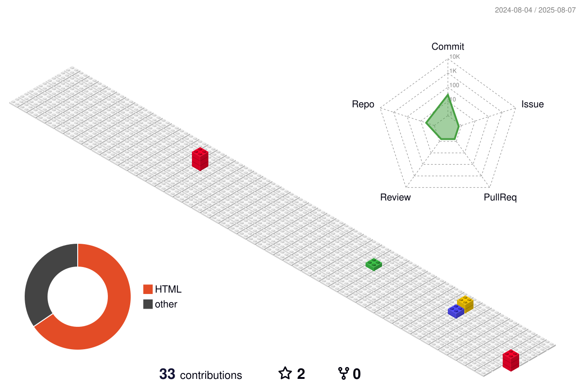

<h1 align="center">Kaio Alves</h1>

  Desenvolvedor Full Stack

---

---

## Sobre

- Atuação em desenvolvimento full stack com Python
- Pós-graduação em Engenharia de Software e Digital Product Leadership
- Experiência em automação de processos e integração de sistemas utilizando Python

## Projetos em destaque

- [Toque AI](https://toqueai.com.br/) – Plataforma de QR Code para identificação e gestão de pets, pessoas e objetos

## Contato

- [LinkedIn](https://www.linkedin.com/in/lucascorreaa/)
